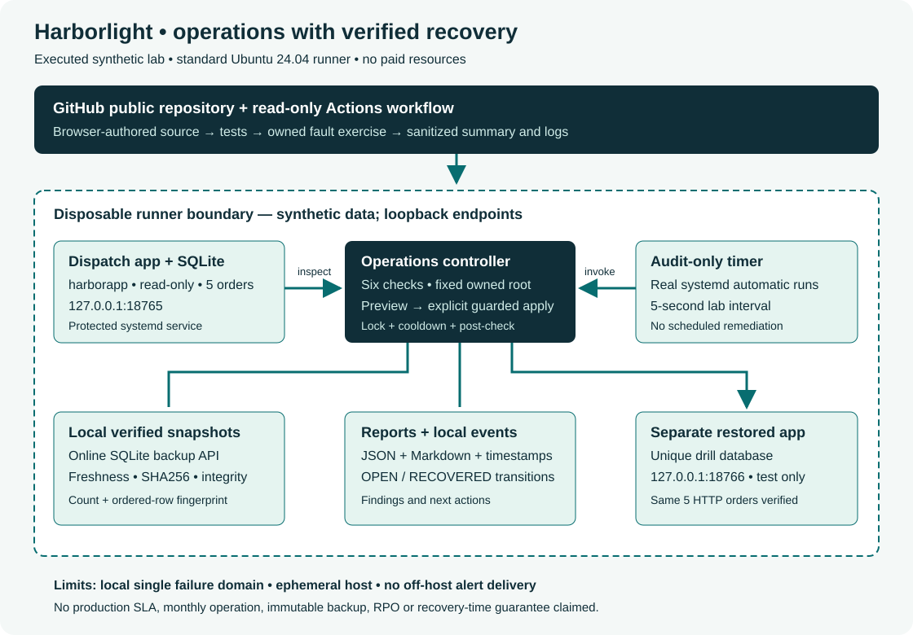

# Architecture and trust boundaries

## Business workload

Harborlight is a fictional dispatch business with five synthetic orders. A small read-only Python HTTP service exposes /health and /orders from SQLite. The application exists to give operations a real service and a real persistent dataset to inspect; it is not a production dispatch product.

## Executed environment

GitHub's standard Ubuntu 24.04 hosted runner is an ephemeral Linux machine with systemd. The browser-authored workflow installs the lab there, executes controlled faults, captures sanitized results and removes its units. This was executed on a GitHub-hosted runner, not AWS, Proxmox or a client server. It creates no cloud instance or account outside GitHub.

## Boundaries

| Boundary | Implementation | Consequence |
|---|---|---|
| Public source / private runtime | Source is public; runtime is disposable and uses synthetic data only. | No production dataset or credential enters CI. |
| Network | App binds 127.0.0.1:18765; restored app briefly binds 127.0.0.1:18766. | No public application listener or remote administration service. |
| Application identity | Locked harborapp account; immutable root-owned source; read-only database/config permissions. | App can serve records without changing source or database. |
| Host / app filesystem | NoNewPrivileges, PrivateTmp, ProtectSystem=strict, ProtectHome and empty capability set. | The app has no intended privileged host operation. |
| Controller / workload | Fixed root /var/lib/harborlight-lab, exact synthetic marker and fixed service name. | No arbitrary host, shell command, unit or production path can be supplied. |
| Concurrent operations | Nonblocking flock around every CLI operation. | Audit, backup, drill and remediation cannot overlap through the CLI. |
| Change authorization | Restart plan by default; explicit --apply, healthy non-service checks and 60-second cooldown. | Recovery is bounded and post-validated; unhealthy data/config/backup stops it. |
| Scheduler / change executor | Timer invokes audit only. | Scheduling does not grant unattended restart or configuration approval. |
| CI / repository | Contents-read token; checkout does not persist credentials. | CI cannot push source or evidence into the repository. |

## Data flow

1. The fixture initializes five orders, a site/mode configuration and an approved configuration SHA256.
2. The unprivileged app reads SQLite and startup configuration, then serves loopback HTTP.
3. An audit queries systemd, HTTP, file digest, SQLite, backup manifest and filesystem free space.
4. It writes a timestamped JSON report, latest JSON/Markdown report and local incident transitions.
5. Backup uses SQLite's online backup API, validates a staging copy, publishes the snapshot and atomically updates its manifest.
6. Restore-drill validates the latest snapshot and creates a separate database. The harness also serves this through a second app and compares all records.
7. Remediation reads all checks first. Only service/health failures with other checks healthy qualify for one explicit restart; all checks run again afterward.
8. The timer proves automatic audits while the guest is active. The workflow summary publishes the acceptance table, while sanitized raw data appears in logs.

## Runtime layout

| Location | Owner / purpose |
|---|---|
| /opt/harborlight-lab/app | Root-owned public application code, readable by service identity. |
| /opt/harborlight-lab/operations | Root-owned controller code. |
| /var/lib/harborlight-lab/LAB.json | Root-owned ownership marker. |
| app.json | Root:harborapp 0640; startup site and mode, no secret. |
| orders.sqlite | Root:harborapp 0640; five synthetic orders, served read-only. |
| control/ | Root-only lock, approved digest, incident state and cooldown. |
| backups/ | Root-only snapshots plus latest manifest. |
| restores/ | Root-only isolated drill databases. |
| reports/ | Root-only timestamped JSON and latest human-readable reports. |
| evidence/run/ in checkout | Sanitized result files generated during the job; no runtime database or private host data. |

## Persistent deployment considerations

A real persistent host would need an approved inventory, explicit operator identity, least-privilege execution policy, owned off-device backup destination, tested retention, reliable time, reboot verification, alert recipients and change windows. The controller would need configurable service/data requirements with validated allowlists instead of this fixed fixture. Keep the timer read-only unless unattended recovery has been explicitly agreed. A production DB with writes also needs workload-specific health and recovery semantics.

No remote SaaS monitoring, public endpoint, paid storage, secret manager, external notification channel, HA cluster, immutable backup or production cutover was implemented. These are limits of the observed design.
